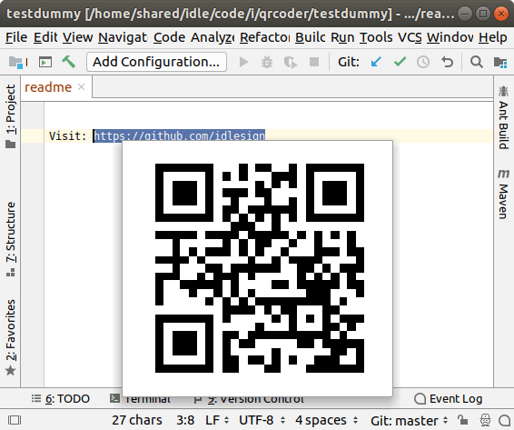

QRCoder
=======
https://github.com/idlesign/qrcoder

Description
-----------

*Plugin for IntelliJ IDEs featuring QR code popups*

Could be useful for presentations when you need to generate QR for some string, e.g. link.

Uses http://goqr.me service to generate QR code images.

How to use
----------

* Install the plugin and restart IDE;
* Select text you want to represent as QR code;
* Press ``AltGr + Q`` to trigger QR code popup.

.. note:: You can bind a custom keystroke for "Show QR Code" action in ``Keymap``.

